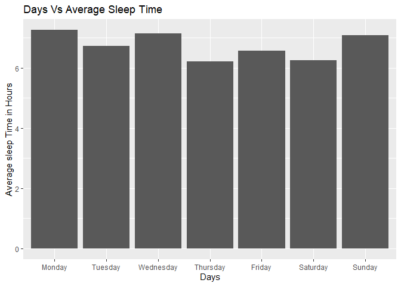

Upgrade Bellabeat Fitness Device
================
2025-04-08

# Problem

Compare Smart Device(fitbit)data to enhance Bellabeat Smart Device and
marking strategy.

# Analytical Goals

- Check the daily activities like sleep, intensity of excercise,
  calories burnt to find the habit of users.
- Add new features to Bellabeat smart device, based on the analysis.
- Suggest marketing pattern to improve the users to use device like
  smart scale to take body weight & height

# Installing & loading the packages for the cleaning,analysis & visualization

install.packages(“tidyverse”) install.packages(“here”)
install.packages(“skimr”) install.packages(“janitor”)
install.packages(“dplyr”) install.packages(“readr”)
install.packages(“smplot2”)

library(smplot2) library(here) library(skimr) library(janitor)
library(dplyr) library(tidyr) library(tidyverse) library(readr)
library(ggplot2)

# Importing the datasets in R-studio.

``` r
inpath <- "C:/Users/basum/Desktop/Google Certification Data Analysis/COURSE 8 -CASTtone/Fitabase Data 4.12.16-5.12.16"
daily_activity <- read.csv(file.path(inpath,"dailyActivity_merged.csv"))
daily_sleep <- read.csv(file.path(inpath,"sleepDay_merged.csv"))
hourly_intensity <- read.csv(file.path(inpath,"hourlyIntensities_merged.csv"))
hourly_calories <- read.csv(file.path(inpath,"hourlyCalories_merged.csv"))
hourly_steps <- read.csv(file.path(inpath,"hourlySteps_merged.csv"))
weight_user <- read.csv(file.path(inpath,"weightLogInfo_merged.csv"))
```

# Check the structure of thedata frames:-

``` r
'View(daily_activity)
View(daily_sleep)
View(hourly_intensity)
View(hourly_calories)
View(hourly_steps)
View(weight_user)'
```

    ## [1] "View(daily_activity)\nView(daily_sleep)\nView(hourly_intensity)\nView(hourly_calories)\nView(hourly_steps)\nView(weight_user)"

# Merge the three datasets(hourly_intensity,hourly_calories,hourly_steps):-

``` r
hourly_action <- merge(hourly_intensity,hourly_calories,by= c("Id","ActivityHour"))
hourly_action <- merge(hourly_action, hourly_steps, by=c("Id","ActivityHour"))
```

# Check the merge Dataset:-

``` r
#View(hourly_action)
```

\#Remove missing values from datasets :-

``` r
hourly_action <- drop_na(hourly_action)
daily_activity <- drop_na(daily_activity)
daily_sleep <- drop_na(daily_sleep)
weight_user <- drop_na(weight_user)
```

# Make sure the Id is in character data type.

``` r
daily_activity_clean <- relocate(
    daily_activity %>% 
    mutate(id = as.character(daily_activity$Id)) %>% 
    select(-Id),id)
daily_sleep_clean <- relocate(daily_sleep %>% mutate(id = as.character(daily_sleep$Id)) %>% select(-Id),id)
hourly_action_clean <- relocate(hourly_action %>% mutate(id= as.character(hourly_action$Id)) %>% select(-Id),id)
weight_user_clean <- relocate(weight_user %>% mutate(id = as.character(weight_user$Id)) %>% select(-Id),id)
```

# cleaning column names format:-

``` r
daily_activity_clean <- clean_names(daily_activity_clean)
daily_sleep_clean <- clean_names(daily_sleep_clean)
hourly_action_clean <- clean_names(hourly_action_clean)
weight_user_clean <- clean_names(weight_user_clean)
```

# Remove duplicates from these four datasets:-

``` r
daily_activity_clean <- unique(daily_activity_clean)
daily_sleep_clean <- unique(daily_sleep_clean)
hourly_action_clean <- unique(hourly_action_clean)
weight_user_clean <- unique(weight_user_clean)
```

# Converting date and time format:-

``` r
daily_activity_clean$activity_date <- mdy(daily_activity_clean$activity_date)
daily_sleep_clean$sleep_day <- mdy_hms(daily_sleep_clean$sleep_day)
hourly_action_clean$activity_hour <- mdy_hms(hourly_action_clean$activity_hour)
weight_user_clean$date <- mdy_hms(weight_user_clean$date)
```

# Transform daily_activity dataset:-

- Added day of the week.
- Added total active hours.

``` r
daily_activity_clean$day_of_the_week <- weekdays(
  daily_activity_clean$activity_date)

daily_activity_clean$total_activity_minutes <-   
  sum(daily_activity_clean$very_active_minutes,
  daily_activity_clean$fairly_active_minutes, 
  daily_activity_clean$lightly_active_minutes,
  daily_activity_clean$sedentary_minutes)
```

# View of the four datasets:-

``` r
'View(daily_activity_clean)
View(daily_sleep_clean)
View(hourly_action_clean)
View(weight_user_clean)'
```

    ## [1] "View(daily_activity_clean)\nView(daily_sleep_clean)\nView(hourly_action_clean)\nView(weight_user_clean)"

# Checked the number of unique ids in these 4 data sets.

``` r
n_distinct(daily_activity_clean$id)
```

    ## [1] 33

``` r
n_distinct(daily_sleep_clean$id)
```

    ## [1] 24

``` r
n_distinct(hourly_action_clean$id)
```

    ## [1] 33

``` r
n_distinct(weight_user_clean$id)
```

    ## [1] 2

# Sample size in weight_user_clean is only two.Excluded from the further analysis

# Visualization :-

## Visualization 1:- Positive correlation between total_steps vs Calories:-

``` r
daily_activity_steps_calories <- daily_activity_clean %>%
  group_by(id) %>% summarize(mean_step=mean(total_steps), mean_calories= mean(calories))
#View(daily_activity_steps_calories)

ggplot(data= daily_activity_steps_calories,  aes(x=mean_step, y=mean_calories)) +   
  geom_point() +   
  sm_statCorr(corr_method = "pearson") +
  labs(title="Daily steps VS Calories", x= "Daily steps", y="Calories")
```

    ## `geom_smooth()` using formula = 'y ~ x'

<!-- -->

## Visualization 2:- Daily steps & calories:-

``` r
daily_activity_days_calories_steps <- daily_activity_clean %>%
    group_by(id,day_of_the_week)%>% summarize(mean_calories=mean(calories), mean_steps=mean(total_steps))
```

    ## `summarise()` has grouped output by 'id'. You can override using the `.groups`
    ## argument.

``` r
ggplot(data=daily_activity_days_calories_steps)+
  geom_boxplot(mapping=aes(x=ordered(day_of_the_week,
  levels=c("Monday","Tuesday", "Wednesday", "Thursday", 
           "Friday", "Saturday","Sunday")), 
  y=mean_calories))+
  labs(title="Days VS Daily Calories", x= "Days", y="Average Calories")
```

<!-- -->

## Visualization 3:- Daily Steps vs Days

``` r
ggplot(data=daily_activity_days_calories_steps)+
  geom_boxplot(mapping=aes(x=ordered(day_of_the_week,
  levels=c("Monday","Tuesday", "Wednesday", "Thursday",
           "Friday", "Saturday","Sunday")), y=mean_steps))+
  labs(title="Days VS Daily Steps", x= "Days", y="Average Steps")
```

<!-- -->

## \#Visualization 4:- Different Activities vs Days

``` r
daily_different_activities <- daily_activity_clean %>%
  group_by(id,day_of_the_week) %>% 
  summarize(average_very_active_hours= mean(very_active_minutes)/60,
            average_fairly_active_hours=mean(fairly_active_minutes)/60,
            average_lightly_active_hours=mean(lightly_active_minutes)/60,
            average_sedentary_hours=mean(sedentary_minutes)/60)
```

    ## `summarise()` has grouped output by 'id'. You can override using the `.groups`
    ## argument.

``` r
daily_different_activities_day <- daily_different_activities %>%
      group_by(day_of_the_week) %>% summarize(very_active_hours=
          mean(average_very_active_hours),
          fairly_active_hours=mean(average_fairly_active_hours),
          lightly_active_hours=mean(average_lightly_active_hours),
          sedentary_hours=mean(average_sedentary_hours))


ggplot(data=daily_different_activities_day)+
  geom_col(mapping=aes(x=day_of_the_week,y=very_active_hours))+
  labs(title="Very Active Hours",x="Days",y="Hours")
```

<!-- -->

``` r
ggplot(data=daily_different_activities_day)+
  geom_col(mapping=aes(x=day_of_the_week,y=fairly_active_hours))+
  labs(title="Fairly Active Hours",x="Days",y="Hours")
```

<!-- -->

``` r
ggplot(data=daily_different_activities_day)+
  geom_col(mapping=aes(x=day_of_the_week,y=lightly_active_hours))+
  labs(title="Lightly Active Hours",x="Days",y="Hours")
```

<!-- -->

``` r
ggplot(data=daily_different_activities_day)+
  geom_col(mapping=aes(x=day_of_the_week,y=sedentary_hours))+
  labs(title="Sedentary Hours",x="Days",y="Hours")
```

<!-- -->
\## Visualization 5:- Daily_sleep_clean

``` r
daily_sleep_clean$day_of_the_week <- weekdays(daily_sleep_clean$sleep_day)
#View(daily_sleep_clean)

daily_sleep_summary <- daily_sleep_clean %>%
    group_by(id,day_of_the_week)%>%
  summarize(mean_time_in_bed = mean(total_time_in_bed) , mean_time_asleep = mean(total_minutes_asleep))
```

    ## `summarise()` has grouped output by 'id'. You can override using the `.groups`
    ## argument.

``` r
ggplot(data= daily_sleep_summary,  aes(x=mean_time_in_bed/60, y=mean_time_asleep/60)) +   
  geom_point(aes(x=mean_time_in_bed/60, y=mean_time_asleep/60)) +   
  sm_statCorr(corr_method = "pearson")+
  labs(x="Hourly Time In Bed", y="Hourly Time Asleep", title="Hours in Bed VS Hourly Asleep")                 
```

    ## `geom_smooth()` using formula = 'y ~ x'

<!-- -->

## Visualization 6:- Daily_sleep_summary (Weekly bed time)

``` r
daily_sleep_day <- daily_sleep_summary %>%
  group_by(day_of_the_week)%>% summarize(average_time_in_bed= 
          mean(mean_time_in_bed), average_time_asleep = mean(mean_time_asleep))

ggplot(data=daily_sleep_day)+
  geom_col(mapping=aes(x=ordered(day_of_the_week,
    levels=c("Monday","Tuesday", "Wednesday", "Thursday","Friday", "Saturday",
    "Sunday")),y= average_time_asleep/60))+ labs(title=
    "Days Vs Average Sleep Time", x="Days",y="Average sleep Time in Hours")
```

<!-- -->

## Visualization 7:- Hours Vs average intensity

``` r
hourly_intensity <- hourly_action_clean %>% drop_na() %>%
    separate(activity_hour, c("date","time"), sep= " ") %>%
  group_by(id,time) %>%
  summarize(average_total_intensity =mean(total_intensity))
```

    ## Warning: Expected 2 pieces. Missing pieces filled with `NA` in 934 rows [7, 31, 55, 79,
    ## 103, 127, 151, 175, 199, 223, 247, 271, 295, 319, 343, 367, 391, 415, 439, 463,
    ## ...].

    ## `summarise()` has grouped output by 'id'. You can override using the `.groups`
    ## argument.

``` r
ggplot(data=drop_na(hourly_intensity))+
  geom_boxplot(mapping = aes(x= time, y= average_total_intensity))+
  labs(title="Time Vs Average Intensity", x="Time",y="Average Intensity")+
  theme(axis.text.x = element_text(angle = 45))
```

<!-- -->

# Conclusion :-

- Steps are positively corelated with Calories.
- Average Daily Calories lost is 2200 calories.Customers prefer weekend
  to exercise most.
- Average Daily steps are 7000.Customers prefer weekend to walk most of
  it.
- Customers prefer 3 to 4 hours of daily light activities.
- Most of the people slept for 6 to 8 hours.
- Average intensity varies on different hours of a day.

# Suggestion :-

- Belllabeat Time and leaf devices should be programmed to capture the
  correct number of steps and to make sure users do not have to input
  the steps manually.
- Belllabeat Time and leaf devices can be programmed to capture average
  daily calories for customer & Bellabeat app can remind them to
  complete the daily calories.
- Belllabeat Time and leaf devices can track the steps & app can remind
  customers to complete it.
- Belllabeat Time and leaf devices can track and remind to complete
  customers daily light activities. Bellabeat membership can provides
  subscribers the monthly packages with light and very active or fairly
  active exercises.
- Belllabeat app can suggest customers to complete daily 6-8hours sleep
  to be healthy.
- High average intensity is around 12pm to 1pm and 6pm to 7pm.
  Belllabeat app can remind customers to complete exercise in these time
  periods.

# Limitation of this Data Analysis:-

- Sample size is based on 30 Fitbit users, which is not big.
- There is no demographic information is available for the users.
- The data is collected by survey, which raised the question on
  authenticity of the data.
- This survey data was collected long back in 2016
- Bellabeat wants to concentrate mainly on women. But this dataset did
  not have information about sex of the customers, which could be
  explored further.

Note that the `echo = FALSE` parameter was added to the code chunk to
prevent printing of the R code that generated the plot.

Github transfers Created using
<https://gist.github.com/JoshuaTPierce/b919168421b40e06481080eb53c3fb2f>

### R Session

``` r
sessionInfo()
```

    ## R version 4.4.3 (2025-02-28 ucrt)
    ## Platform: x86_64-w64-mingw32/x64
    ## Running under: Windows 11 x64 (build 22631)
    ## 
    ## Matrix products: default
    ## 
    ## 
    ## locale:
    ## [1] LC_COLLATE=English_United States.utf8 
    ## [2] LC_CTYPE=English_United States.utf8   
    ## [3] LC_MONETARY=English_United States.utf8
    ## [4] LC_NUMERIC=C                          
    ## [5] LC_TIME=English_United States.utf8    
    ## 
    ## time zone: America/New_York
    ## tzcode source: internal
    ## 
    ## attached base packages:
    ## [1] stats     graphics  grDevices utils     datasets  methods   base     
    ## 
    ## other attached packages:
    ##  [1] lubridate_1.9.4 forcats_1.0.0   stringr_1.5.1   purrr_1.0.4    
    ##  [5] readr_2.1.5     tibble_3.2.1    ggplot2_3.5.1   tidyverse_2.0.0
    ##  [9] tidyr_1.3.1     dplyr_1.1.4     janitor_2.2.1   skimr_2.1.5    
    ## [13] here_1.0.1      smplot2_0.2.5  
    ## 
    ## loaded via a namespace (and not attached):
    ##  [1] gtable_0.3.6      xfun_0.51         htmlwidgets_1.6.4 rstatix_0.7.2    
    ##  [5] lattice_0.22-6    tzdb_0.4.0        vctrs_0.6.5       tools_4.4.3      
    ##  [9] generics_0.1.3    cluster_2.1.8     pkgconfig_2.0.3   Matrix_1.7-2     
    ## [13] data.table_1.17.0 checkmate_2.3.2   lifecycle_1.0.4   compiler_4.4.3   
    ## [17] farver_2.1.2      munsell_0.5.1     repr_1.1.7        snakecase_0.11.1 
    ## [21] carData_3.0-5     htmltools_0.5.8.1 yaml_2.3.10       htmlTable_2.4.3  
    ## [25] Formula_1.2-5     pillar_1.10.1     car_3.1-3         ggpubr_0.6.0     
    ## [29] Hmisc_5.2-3       rpart_4.1.24      abind_1.4-8       nlme_3.1-167     
    ## [33] tidyselect_1.2.1  digest_0.6.37     stringi_1.8.4     labeling_0.4.3   
    ## [37] splines_4.4.3     cowplot_1.1.3     rprojroot_2.0.4   fastmap_1.2.0    
    ## [41] grid_4.4.3        colorspace_2.1-1  cli_3.6.4         magrittr_2.0.3   
    ## [45] patchwork_1.3.0   base64enc_0.1-3   broom_1.0.7       withr_3.0.2      
    ## [49] foreign_0.8-88    scales_1.3.0      backports_1.5.0   timechange_0.3.0 
    ## [53] rmarkdown_2.29    nnet_7.3-20       gridExtra_2.3     ggsignif_0.6.4   
    ## [57] hms_1.1.3         zoo_1.8-13        evaluate_1.0.3    knitr_1.49       
    ## [61] pwr_1.3-0         mgcv_1.9-1        rlang_1.1.5       glue_1.8.0       
    ## [65] rstudioapi_0.17.1 jsonlite_1.9.0    R6_2.6.1
